# Edvance - Educational Content Management System

## Table of Contents
- [Overview](#overview)
- [Architecture](#architecture)
- [Technology Stack](#technology-stack)
- [System Components](#system-components)
- [Business Domain](#business-domain)
- [API Gateway](#api-gateway)
- [Content Service](#content-service)
- [Infrastructure](#infrastructure)
- [Data Model](#data-model)
- [Deployment](#deployment)
- [Development](#development)
- [Product Vision](#product-vision)

## Overview

Edvance is a modern, cloud-native educational content management system built using a microservices architecture with .NET 9. The platform is designed to handle academic content delivery, course management, assignment creation, and student submissions in a scalable and maintainable way.

### Key Features
- **Course Management**: Create, update, and manage educational courses
- **Assignment System**: Comprehensive assignment lifecycle management
- **Submission Tracking**: Student assignment submission and tracking
- **API Gateway**: Centralized routing and aggregation
- **Microservices Architecture**: Scalable and maintainable service design
- **Real-time Messaging**: Event-driven communication between services
- **Health Monitoring**: Built-in health checks and observability

## Architecture

The system follows a **microservices architecture** with clean architecture principles, implementing Domain-Driven Design (DDD) patterns and CQRS (Command Query Responsibility Segregation).

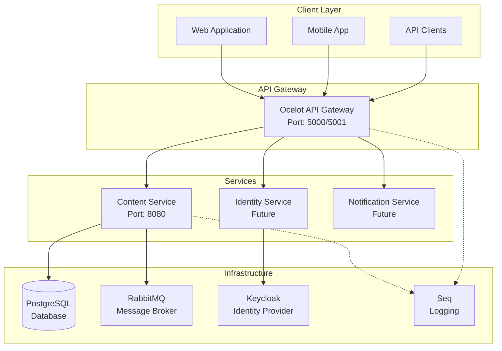

### Architecture Principles

1. **Separation of Concerns**: Each service has a single responsibility
2. **Clean Architecture**: Dependencies point inward toward the domain
3. **CQRS Pattern**: Separate read and write operations
4. **Event-Driven**: Asynchronous communication via message broker
5. **API-First**: Well-defined contracts between services
6. **Cloud-Native**: Containerized deployment with Docker

## Technology Stack

### Backend Technologies
- **.NET 9**: Latest version of Microsoft's development platform
- **ASP.NET Core**: Web framework for APIs
- **Entity Framework Core**: Object-relational mapping (ORM)
- **PostgreSQL**: Primary database for data persistence
- **RabbitMQ**: Message broker for asynchronous communication
- **MassTransit**: Distributed application framework for .NET
- **Ocelot**: API Gateway for .NET Core
- **FluentValidation**: Business rule validation
- **Serilog**: Structured logging framework

### Infrastructure & DevOps
- **Docker**: Containerization platform
- **Docker Compose**: Multi-container application orchestration
- **Keycloak**: Identity and access management
- **Seq**: Centralized logging and monitoring
- **Swagger/OpenAPI**: API documentation
- **Health Checks**: Service health monitoring

### Development Tools
- **JetBrains Rider**: Primary IDE
- **Central Package Management**: Unified dependency management
- **Scrutor**: Assembly scanning and decoration

## System Components

### 1. API Gateway (`ApiGateway.Web.Api`)

The API Gateway serves as the single entry point for all client requests, providing:

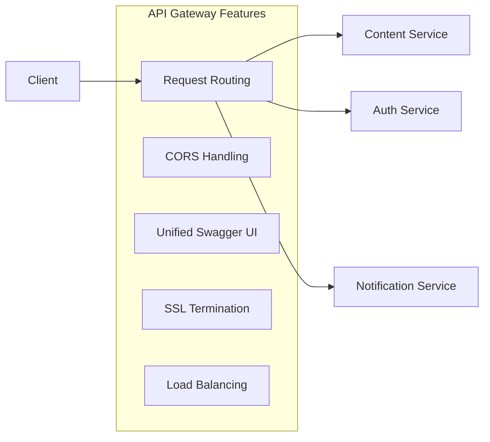

**Key Features:**
- **Ocelot Configuration**: Routes requests to appropriate downstream services
- **CORS Policy**: Configured for frontend origins (localhost:3001)
- **Swagger Aggregation**: Unified API documentation
- **SSL/TLS**: Certificate-based security
- **Health Checks**: Gateway health monitoring

### 2. Content Service (`ContentService`)

The Content Service is the core domain service managing educational content:

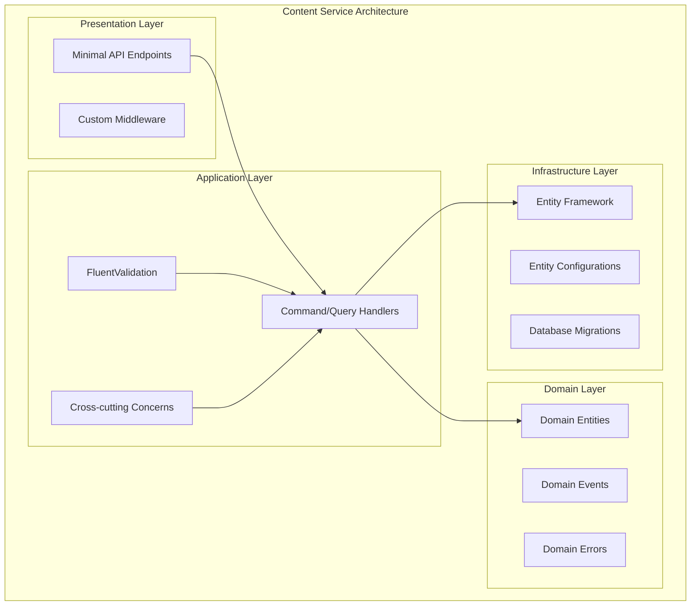

#### Clean Architecture Layers

1. **Presentation Layer** (`ContentService.Web.Api`)
    - Minimal API endpoints using the endpoint pattern
    - Custom middleware for cross-cutting concerns
    - Dependency injection configuration
    - Health checks and monitoring

2. **Application Layer** (`ContentService.Application`)
    - CQRS implementation with command and query handlers
    - FluentValidation for business rule validation
    - Decorator pattern for cross-cutting concerns (logging, validation)
    - MassTransit configuration for messaging

3. **Domain Layer** (`ContentService.Domain`)
    - Rich domain entities with business logic
    - Domain events for business state changes
    - Value objects and domain errors
    - Repository abstractions

4. **Infrastructure Layer** (`ContentService.Infrastructure`)
    - Entity Framework Core configurations
    - Database migrations
    - Repository implementations
    - External service integrations

5. **Shared Kernel** (`ContentService.SharedKernel`)
    - Common abstractions and base classes
    - Result pattern implementation
    - Error handling infrastructure
    - Domain event abstractions

## Business Domain

### Core Entities

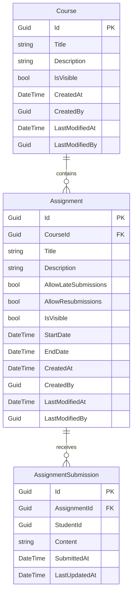

### Business Rules

1. **Course Management**
    - Courses can be visible or hidden from students
    - Course title is required and limited to 100 characters
    - Course description is optional but limited to 500 characters
    - Track creation and modification metadata

2. **Assignment Management**
    - Assignments belong to exactly one course
    - Assignments can allow late submissions and resubmissions
    - Assignment visibility can be controlled independently
    - Start and end dates are optional but provide scheduling control
    - Assignment title is required (max 200 characters)
    - Assignment description is optional (max 1000 characters)

3. **Submission System**
    - Students can submit content for assignments
    - Submissions track creation and modification times
    - Content updates are versioned through LastUpdatedAt
    - Submissions are linked to both assignment and student

### Use Cases

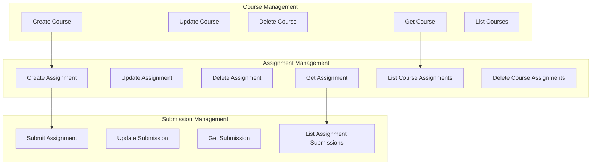

## API Gateway

### Ocelot Configuration

The API Gateway uses Ocelot to route requests to downstream services:

```json
{
  "Routes": [
    {
      "UpstreamPathTemplate": "/api/content/{everything}",
      "UpstreamHttpMethod": [ "GET", "POST", "PUT", "DELETE" ],
      "DownstreamPathTemplate": "/{everything}",
      "DownstreamScheme": "http",
      "DownstreamHostAndPorts": [
        {
          "Host": "edvance.content-service",
          "Port": 8080
        }
      ]
    }
  ]
}
```

### Key Features

1. **Unified Entry Point**: Single endpoint for all API requests
2. **Service Discovery**: Routes to containerized services
3. **Cross-Cutting Concerns**: CORS, authentication, logging
4. **Documentation**: Swagger UI aggregation
5. **Load Balancing**: Multiple downstream instances support

## Content Service

### API Endpoints

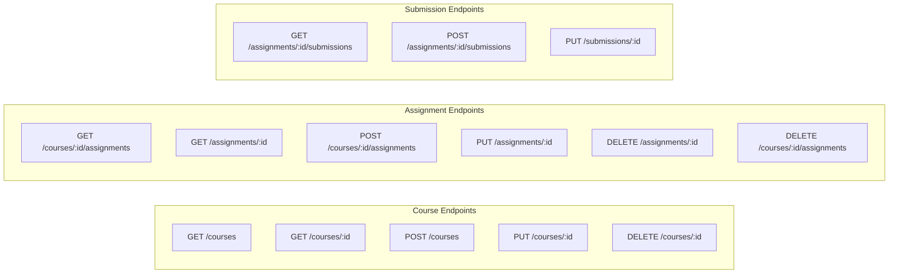

### CQRS Implementation

The service implements CQRS with separate command and query models:

```mermaid
graph TB
    subgraph "Commands (Write Side)"
        CREATE_COURSE[CreateCourseCommand]
        UPDATE_COURSE[UpdateCourseCommand]
        DELETE_COURSE[DeleteCourseCommand]
        
        CREATE_ASSIGNMENT[CreateAssignmentCommand]
        UPDATE_ASSIGNMENT[UpdateAssignmentCommand]
        DELETE_ASSIGNMENT[DeleteAssignmentCommand]
        
        SUBMIT_ASSIGNMENT[SubmitAssignmentCommand]
        UPDATE_SUBMISSION[UpdateSubmissionCommand]
    end
    
    subgraph "Queries (Read Side)"
        GET_COURSES[GetCoursesQuery]
        GET_COURSE_BY_ID[GetCourseByIdQuery]
        
        GET_ASSIGNMENTS[GetAssignmentsByCourseIdQuery]
        GET_ASSIGNMENT_BY_ID[GetAssignmentByIdQuery]
        
        GET_SUBMISSIONS[GetSubmissionsByAssignmentIdQuery]
    end
    
    subgraph "Handlers"
        COMMAND_HANDLERS[Command Handlers]
        QUERY_HANDLERS[Query Handlers]
    end
    
    CREATE_COURSE --> COMMAND_HANDLERS
    GET_COURSES --> QUERY_HANDLERS
```

### Validation Strategy

The service uses FluentValidation for business rule enforcement:

```csharp
public class CreateCourseValidator : AbstractValidator<CreateCourseCommand>
{
    public CreateCourseValidator()
    {
        RuleFor(command => command.Title)
            .NotEmpty()
            .WithMessage("Title is required.")
            .MaximumLength(100)
            .WithMessage("Title must not exceed 100 characters.");
        
        RuleFor(command => command.Description)
            .MaximumLength(500)
            .WithMessage("Description must not exceed 500 characters.");
    }
}
```

### Error Handling

Robust error handling using the Result pattern:

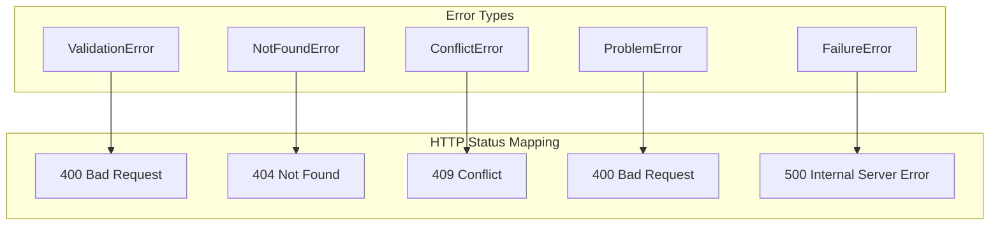

## Infrastructure

### Database Design

The system uses PostgreSQL with Entity Framework Core:

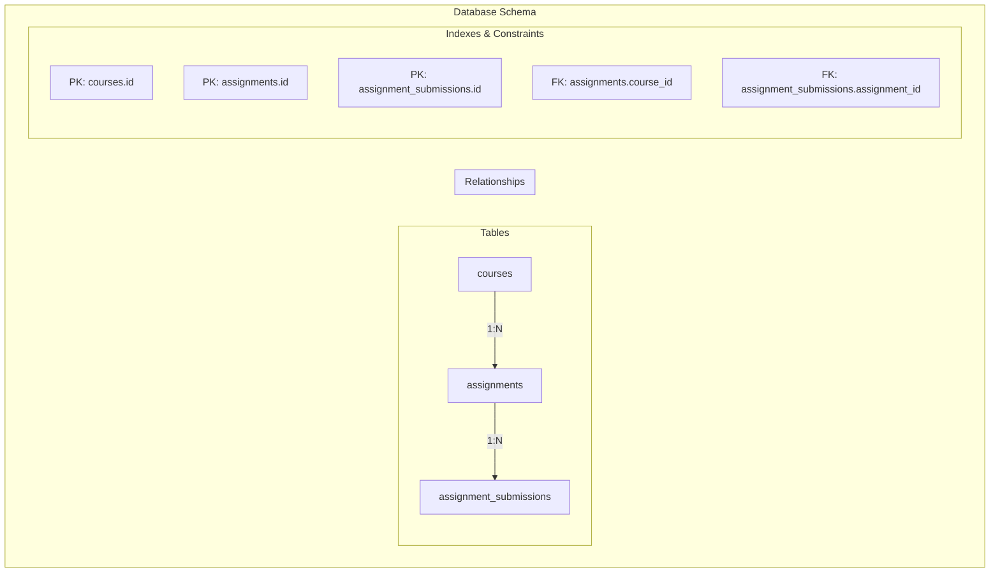

### Entity Framework Configuration

Entity configurations ensure proper database mapping:

```csharp
public class CourseConfiguration : IEntityTypeConfiguration<Course>
{
    public void Configure(EntityTypeBuilder<Course> builder)
    {
        builder.HasKey(course => course.Id);
        builder.Property(course => course.Title)
            .IsRequired()
            .HasMaxLength(100);
        builder.Property(course => course.CreatedAt)
            .HasDefaultValueSql("CURRENT_TIMESTAMP");
    }
}
```

### Messaging Infrastructure

The system uses RabbitMQ with MassTransit for event-driven communication:

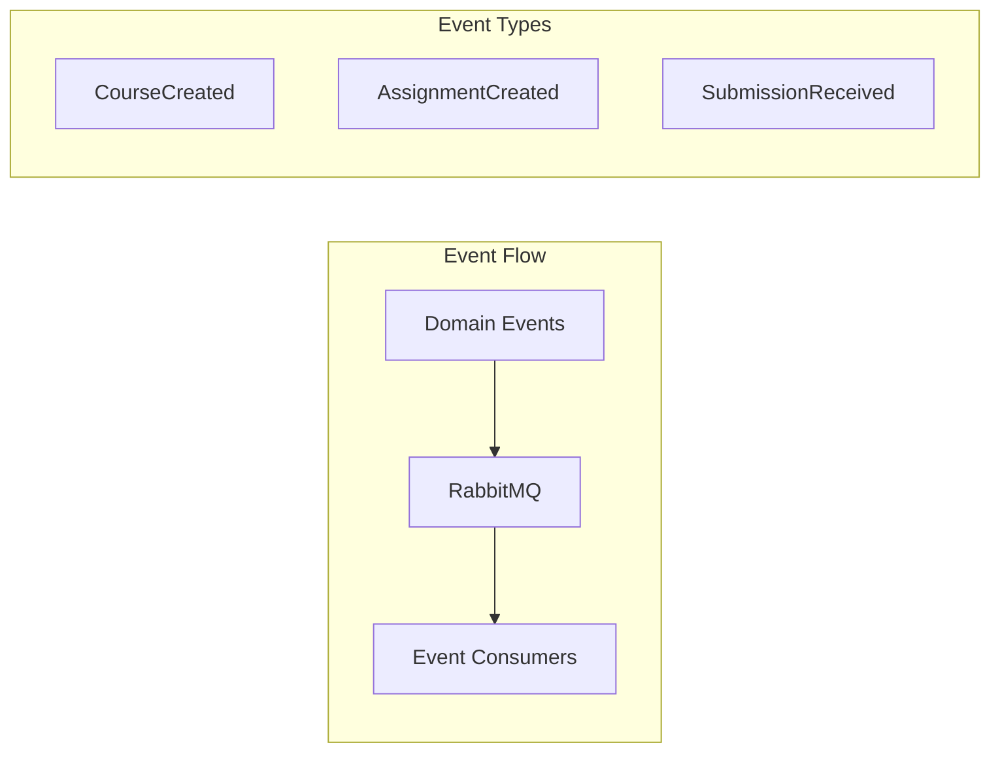

## Data Model

### Entity Relationships

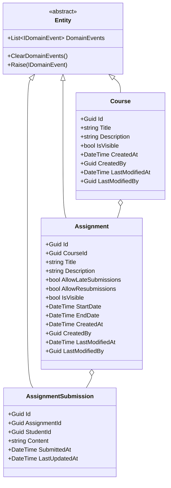

### Result Pattern

The system implements a robust Result pattern for error handling:

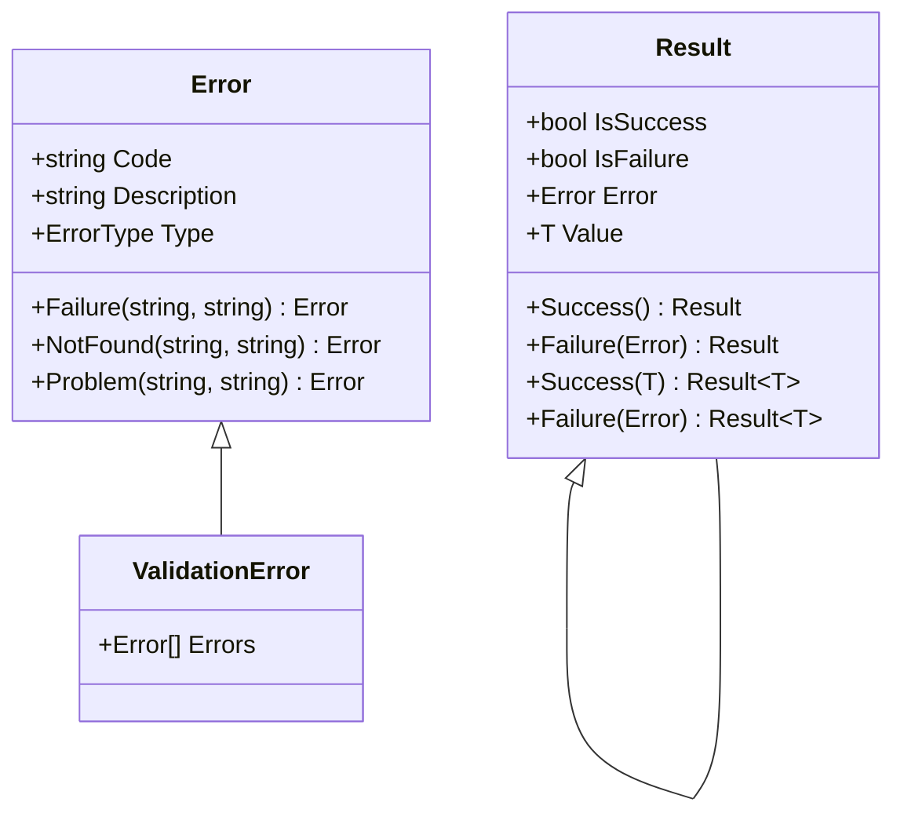

## Deployment

### Docker Configuration

The system is fully containerized using Docker:

```dockerfile
# Content Service Dockerfile
FROM mcr.microsoft.com/dotnet/aspnet:9.0 AS base
WORKDIR /app
EXPOSE 8080

FROM mcr.microsoft.com/dotnet/sdk:9.0 AS build
WORKDIR /src
COPY ["ContentService.Web.Api.csproj", "."]
RUN dotnet restore
COPY . .
RUN dotnet build -c Release -o /app/build

FROM build AS publish
RUN dotnet publish -c Release -o /app/publish

FROM base AS final
WORKDIR /app
COPY --from=publish /app/publish .
ENTRYPOINT ["dotnet", "ContentService.Web.Api.dll"]
```

### Docker Compose Architecture

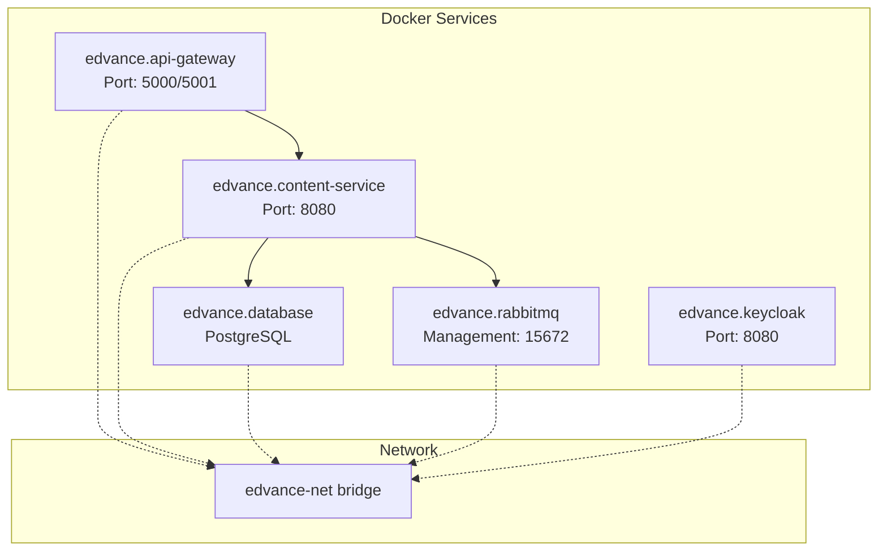

### Infrastructure Services

```yaml
services:
  edvance.database:
    image: postgres:17.4
    environment:
      POSTGRES_DB: edvance
      POSTGRES_USER: postgres
      POSTGRES_PASSWORD: postgres
    
  edvance.rabbitmq:
    image: rabbitmq:4.1.0-management
    environment:
      RABBITMQ_DEFAULT_USER: guest
      RABBITMQ_DEFAULT_PASS: guest
    
  edvance.keycloak:
    image: quay.io/keycloak/keycloak:26.2.2
    environment:
      KEYCLOAK_ADMIN: admin
      KEYCLOAK_ADMIN_PASSWORD: admin
```

## Development

### Prerequisites

- .NET 9 SDK
- Docker Desktop
- PostgreSQL (for local development)
- RabbitMQ (for local development)
- JetBrains Rider or Visual Studio

### Getting Started

1. **Clone the Repository**
   ```bash
   git clone <repository-url>
   cd Edvance
   ```

2. **Run Infrastructure Services**
   ```bash
   docker-compose up -d edvance.database edvance.rabbitmq edvance.keycloak
   ```

3. **Run the Application**
   ```bash
   # Start API Gateway
   cd src/ApiGateway/ApiGateway.Web.Api
   dotnet run
   
   # Start Content Service
   cd src/Services/ContentService/ContentService.Web.Api
   dotnet run
   ```

4. **Access the Application**
    - API Gateway: https://localhost:5001
    - Content Service: https://localhost:8080
    - Swagger UI: https://localhost:5001/swagger

### Development Workflow

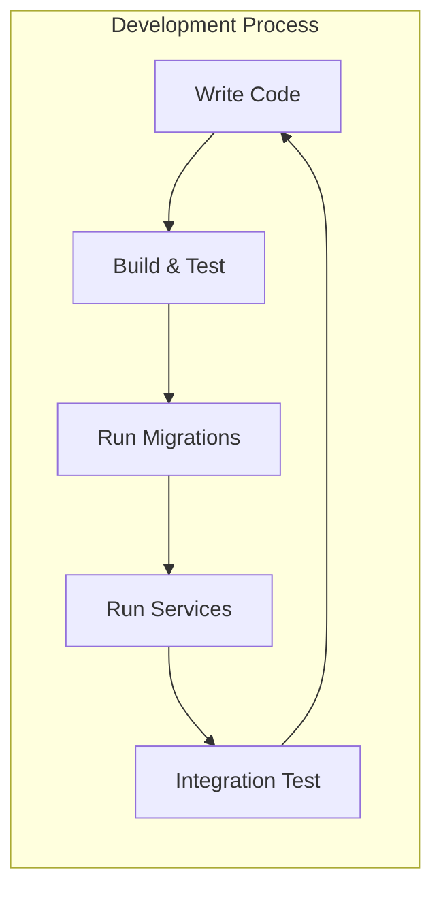

### Project Structure

```
Edvance/
├── src/
│   ├── ApiGateway/
│   │   └── ApiGateway.Web.Api/          # API Gateway service
│   └── Services/
│       └── ContentService/
│           ├── ContentService.Domain/    # Domain entities and logic
│           ├── ContentService.Application/  # Use cases and handlers
│           ├── ContentService.Infrastructure/  # Data access and external services
│           ├── ContentService.Web.Api/   # API endpoints and configuration
│           └── ContentService.SharedKernel/  # Shared abstractions
├── docker-compose.yaml                  # Container orchestration
├── Directory.Packages.props             # Central package management
└── Edvance.sln                         # Solution file
```

### Code Quality Standards

1. **Clean Code Principles**
    - Single Responsibility Principle
    - Dependency Inversion
    - Explicit dependencies
    - Meaningful naming

2. **Architecture Patterns**
    - Clean Architecture
    - CQRS
    - Repository Pattern
    - Decorator Pattern

3. **Testing Strategy**
    - Unit tests for domain logic
    - Integration tests for API endpoints
    - Health checks for monitoring

## Product Vision

### Current State (MVP)

Edvance currently provides a solid foundation for educational content management with:

- **Core Domain Coverage**: Courses, assignments, and submissions
- **Scalable Architecture**: Microservices with clean separation
- **Modern Technology Stack**: .NET 9, PostgreSQL, RabbitMQ
- **API-First Design**: RESTful APIs with comprehensive documentation
- **Container-Ready**: Docker-based deployment strategy

### Roadmap

#### Phase 1: Enhanced Content Management
- **Rich Text Support**: Enhanced content editing capabilities
- **File Attachments**: Support for multimedia content
- **Content Versioning**: Track changes and revisions
- **Content Templates**: Reusable assignment templates

#### Phase 2: User Management & Security
- **Identity Service**: Complete user management system
- **Role-Based Access Control**: Granular permissions
- **JWT Authentication**: Secure token-based auth
- **Audit Logging**: Comprehensive activity tracking

#### Phase 3: Advanced Features
- **Grading System**: Automated and manual grading
- **Analytics Service**: Learning analytics and reporting
- **Notification Service**: Real-time notifications
- **Discussion Forums**: Collaborative learning spaces

#### Phase 4: Scale & Performance
- **Caching Layer**: Redis for performance optimization
- **Search Service**: Elasticsearch for content discovery
- **CDN Integration**: Global content delivery
- **Monitoring**: Comprehensive observability

### Business Value Proposition

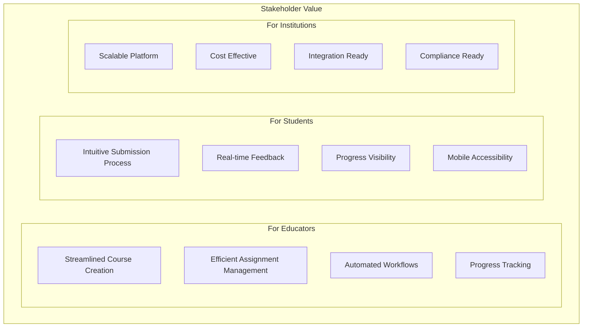

### Technical Excellence

1. **Maintainability**: Clear architecture boundaries and separation of concerns
2. **Scalability**: Horizontal scaling through microservices
3. **Reliability**: Robust error handling and health monitoring
4. **Security**: Industry-standard security practices
5. **Performance**: Optimized data access and caching strategies
6. **Observability**: Comprehensive logging and monitoring

### Competitive Advantages

- **Modern Architecture**: Cloud-native, microservices-based design
- **Developer Experience**: Clean code, comprehensive documentation
- **Flexibility**: Extensible architecture for custom requirements
- **Performance**: High-performance .NET 9 runtime
- **Cost Efficiency**: Open-source technologies and container deployment
- **Integration**: API-first design for easy integrations

---

**Edvance** represents the future of educational technology - combining modern software architecture with educational domain expertise to create a platform that scales with institutional needs while maintaining simplicity for end users.

For technical questions or contributions, please refer to the development documentation or contact the development team.
